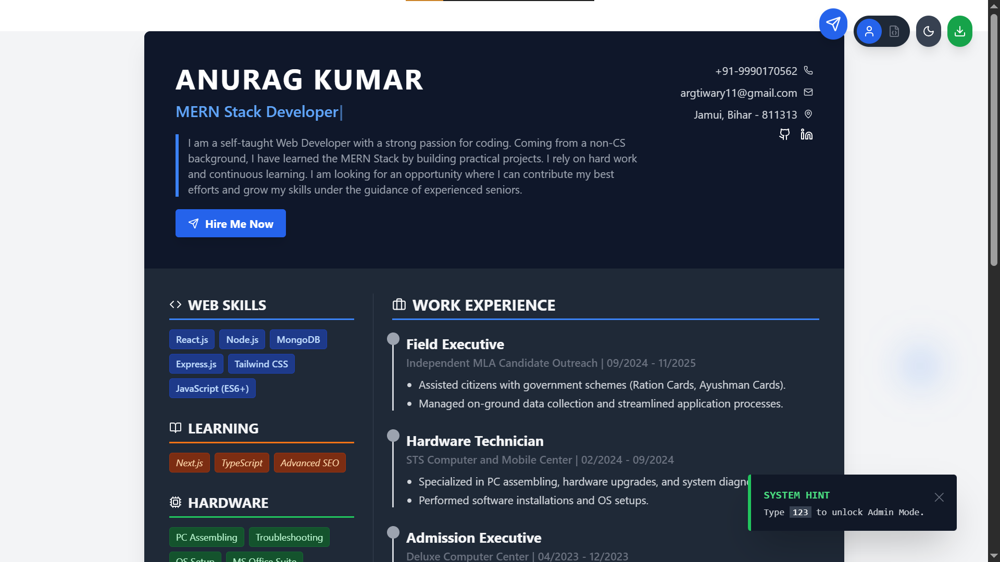

# 👨‍💻 The Interactive "Hacker" Resume

> **Warning:** This is not just a PDF. It's a digital playground.  
> *Proceed with curiosity.* 🚀

g
https://my-interactive-resume-two.vercel.app/

---

## 🕵️‍♂️ Mission Briefing
Hi, I'm **Anurag Kumar**, a Full Stack Web Developer.  
Standard resumes are boring. As a developer, I believe my resume should demonstrate my skills, not just list them.  
This project is a **Hybrid Resume**—a fusion of a professional document and an interactive web app.

### 🌟 Live Demo
👉 **[Click Here to Enter the System](https://my-interactive-resume-two.vercel.app/)** *(Don't forget to try the secret code... if you can find it)*

---

## 🔥 Top Secret Features (Why this is Cool)

| Feature | Description | Tech Used |
| :--- | :--- | :--- |
| **🎨 Hybrid UI** | Looks like paper, behaves like an app. | React + Tailwind |
| **🕶️ Hacker Mode** | A secret Matrix rain effect triggered by a Konami code. | Canvas API |
| **🔄 3D Tilt** | The resume reacts to your mouse movement. | React-Parallax-Tilt |
| **👨‍💻 Dev Mode** | Toggle between "Human View" and "JSON View". | State Management |
| **🎉 Confetti** | Celebrating downloads and hires with style. | Canvas Confetti |
| **📱 Mobile Polish** | Optimized for all devices (No lag, pure performance). | Responsive Design |

---

## 🎮 Easter Eggs (Can you find them?)

This resume contains hidden interactions to test your "Geek" level:

1.  **The Konami Code:** Type `1` `2` `3` on your keyboard to hack the system. 🟩
2.  **JSON Toggle:** Click the `{ }` icon to see my raw data structure.
3.  **Hire Me:** Click the send button to trigger a direct email gateway.

---

## 🛠️ Tech Stack (The Arsenal)

* **Core:** [React.js](https://reactjs.org/), [Vite](https://vitejs.dev/)
* **Styling:** [Tailwind CSS](https://tailwindcss.com/)
* **Animations:** [Framer Motion](https://www.framer.com/motion/)
* **Icons:** [Lucide React](https://lucide.dev/)
* **Magic:** `react-parallax-tilt`, `canvas-confetti`, `typewriter-effect`

---

## 🚀 How to Run Locally

Want to inspect the code? Follow these steps to clone the system:

```bash
# 1. Clone the repository
git clone [https://github.com/argtiwari/my-interactive-resume.git]

# 2. Enter the directory
cd interactive-resume

# 3. Install dependencies (The fuel)
npm install

# 4. Start the development server
npm run dev